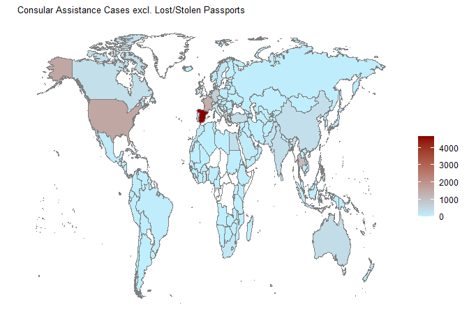
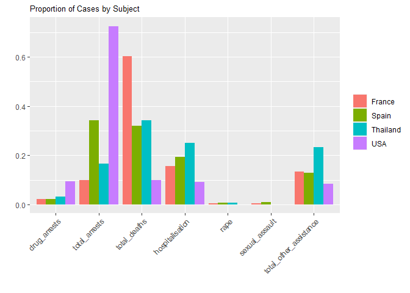
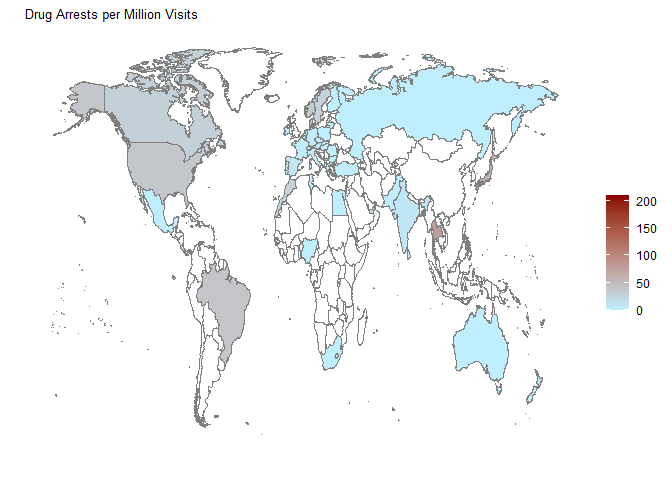
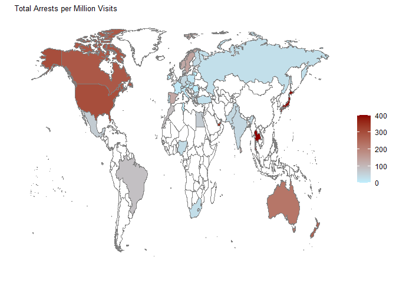
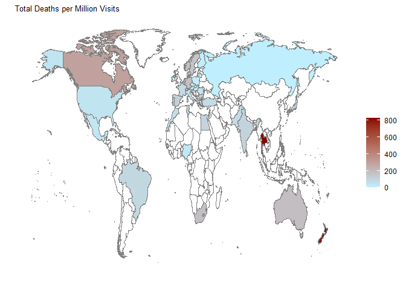
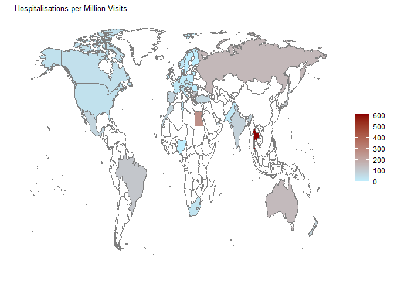
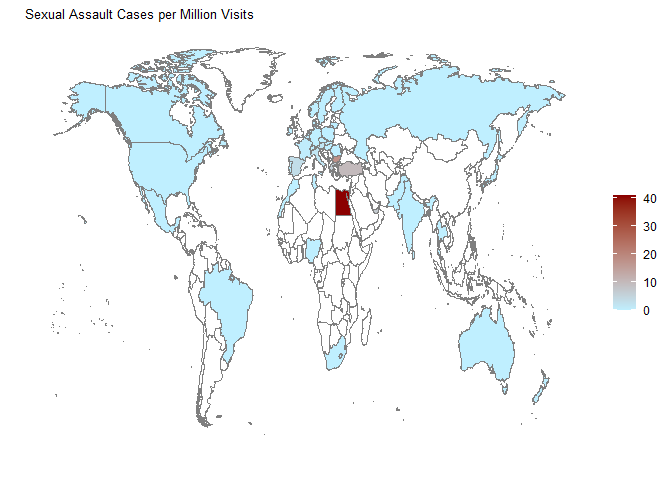
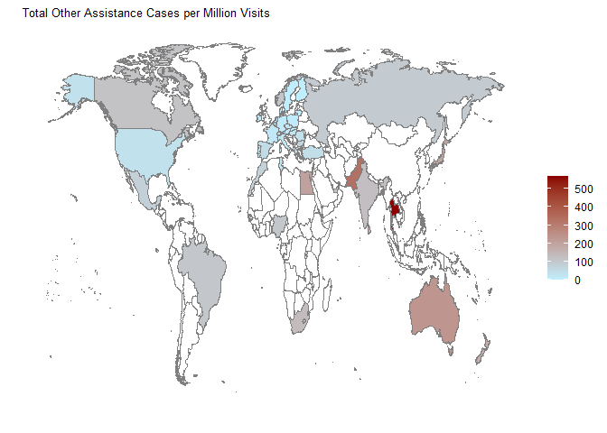
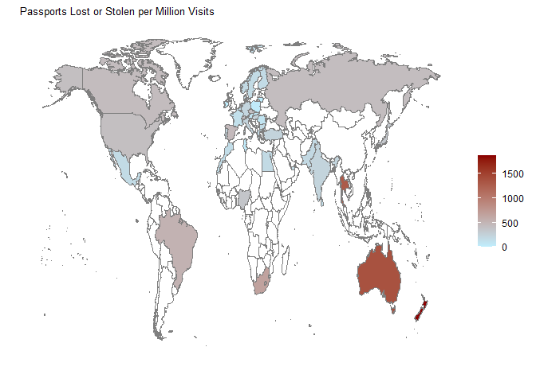
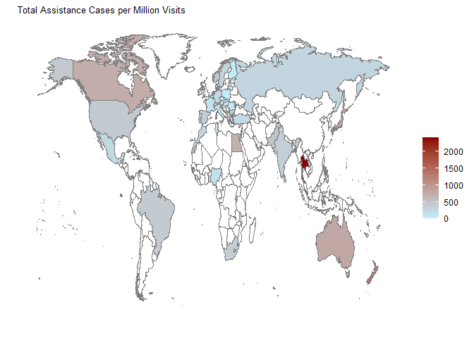

British Behaviour Abroad
================

# Introduction

This notebook contains an exploratory data analysis of the [British
Behaviour
Abroad](https://www.data.gov.uk/dataset/35f0785d-e85b-49ef-869c-2eca49755aa5/british-behaviour-abroad)
dataset provided by the UK government. The data shows the number of
consular assistance cases in countries around the world between April
2012 and March 2013.

Contains public sector information licensed under the Open Government
Licence v3.0.

``` r
library(pacman)

pacman::p_load(pacman, dplyr, ggplot2, maps, reshape2)
```

# Data Loading and Cleaning

``` r
url <- "https://www.gov.uk/government/uploads/system/uploads/attachment_data/file/259521/British_Behaviour_Abroad_2012-2013_data.csv"
df <- read.csv(url, col.names = c("country", "drug_arrests", "total_arrests", "total_deaths", "hospitalisation", "rape",
                                  "sexual_assault", "total_other_assistance", "total_assistance", "passport_lost_stolen",
                                  "X"))

# Remove unnecessary final column
df[, c(length(df))] <- NULL

# Remove final aggregate entry
df <- head(df, -1)

# Cast columns to numeric and replace "<5" string
df <- data.frame(lapply(df, function(x) {
  gsub("<5", "0", x)
}))
df[, -1] <- lapply(df[, -1], as.integer)

str(df)
```

    ## 'data.frame':    166 obs. of  10 variables:
    ##  $ country               : chr  "Afghanistan" "Albania" "Algeria" "Angola" ...
    ##  $ drug_arrests          : int  0 0 0 0 0 0 0 0 0 0 ...
    ##  $ total_arrests         : int  0 0 0 0 0 0 0 0 106 0 ...
    ##  $ total_deaths          : int  0 0 5 0 0 0 0 0 87 17 ...
    ##  $ hospitalisation       : int  0 0 0 0 0 0 0 0 69 11 ...
    ##  $ rape                  : int  0 0 0 0 0 0 0 0 0 0 ...
    ##  $ sexual_assault        : int  0 0 0 0 0 0 0 0 0 1 ...
    ##  $ total_other_assistance: int  15 0 17 0 0 0 0 0 109 8 ...
    ##  $ total_assistance      : int  15 0 22 0 0 0 0 0 371 37 ...
    ##  $ passport_lost_stolen  : int  27 12 11 14 0 0 103 0 640 57 ...

# Where do Brits most end up in trouble?

``` r
plot_map <- function(df, variable, title) {
  map <- map_data("world") %>% filter(region != "Antarctica") %>% fortify
  
  ggplot() +
    geom_map(data = map, map = map, aes(x = long, y = lat, group = group, map_id = region), fill = "white",
             colour = "#7f7f7f") +
    geom_map(data = df, map = map, aes(fill = variable, map_id = country), colour = "#7f7f7f") +
    scale_fill_continuous(low = "lightblue1", high = "darkred", guide = "colorbar") +
    scale_x_continuous(breaks = c()) +
    scale_y_continuous(breaks = c()) +
    labs(fill = "", title = title, x = "", y = "") +
    theme_minimal() +
    theme(plot.title = element_text(size = 10))
}
```

``` r
plot_map(df, df$total_assistance, "Consular Assistance Cases excl. Lost/Stolen Passports")
```

<!-- -->

Spain sees the most cases followed by the United States and France,
although this is not so surprising since they are the most frequently
visited countries by UK residents in 2013 (source: [International
Passenger Survey (IPS) - Office for National
Statistics](https://www.ons.gov.uk/peoplepopulationandcommunity/leisureandtourism/articles/traveltrends/2014-05-08#commentary-uk-residents-visits-abroad)).
Thailand, although much less visited, is a close fourth.

Let’s take a look at the breakdown of cases for these four countries.

``` r
df_pct <- df

df_pct$drug_arrests <- df_pct$drug_arrests / df_pct$total_assistance
df_pct$total_arrests <- df_pct$total_arrests / df_pct$total_assistance
df_pct$total_deaths <- df_pct$total_deaths / df_pct$total_assistance
df_pct$hospitalisation <- df_pct$hospitalisation / df_pct$total_assistance
df_pct$rape <- df_pct$rape / df_pct$total_assistance
df_pct$sexual_assault <- df_pct$sexual_assault / df_pct$total_assistance
df_pct$total_other_assistance <- df_pct$total_other_assistance / df_pct$total_assistance

df_pct <- df_pct[, 1:(length(df_pct) - 2)]

sel <- c("Spain", "USA", "France", "Thailand")
df_sel <- df_pct[df_pct$country %in% sel,]

df_sel <- melt(df_sel, id = "country")

ggplot(data = df_sel, aes(x = variable, y = value, fill = country)) +
  geom_bar(stat = "identity", position = position_dodge()) +
  scale_x_discrete(guide = guide_axis(angle = 45)) +
  labs(fill = "", title = "Proportion of Cases by Subject", x = "", y = "") +
  theme(plot.title = element_text(size = 10))
```

<!-- -->

The distribution of consular assistance cases varies per country, but it
seems arrests and deaths make up the majority of cases. It is
interesting to see that almost three quarters of consular assistance
cases in the USA are linked with arrests whereas 60% of cases in France
are linked with deaths.

# Where are Brits most likely to get in trouble?

Since the data is in absolute numbers and not, say, per 100,000 visits,
the data does not give much more insight than simply looking at number
of visits per country. Looking at the data alongside the number of
visits to each country should reveal some new insights.

Data for the number of visits (in millions) to some of the UK’s top
travel destinations for different years can be found
[here](https://www.finder.com/uk/outbound-tourism-statistics). The
following analysis uses data for the year 2012. Although the number of
visits is not available for all countries, it is available for the most
visited countries which means we can consider our analysis to only
include countries with a sufficient number of visits.

``` r
df_visits <- read.csv("visits_abroad_2012.csv", col.names = c("country", "visits"))

str(df_visits)
```

    ## 'data.frame':    51 obs. of  2 variables:
    ##  $ country: chr  "Spain" "France" "Italy" "USA" ...
    ##  $ visits : num  12.24 10.42 3.07 3.74 3.72 ...

``` r
df_visits <- merge(df, df_visits, by = "country")

df_visits$drug_arrests <- df_visits$drug_arrests / df_visits$visits
df_visits$total_arrests <- df_visits$total_arrests / df_visits$visits
df_visits$total_deaths <- df_visits$total_deaths / df_visits$visits
df_visits$hospitalisation <- df_visits$hospitalisation / df_visits$visits
df_visits$rape <- df_visits$rape / df_visits$visits
df_visits$sexual_assault <- df_visits$sexual_assault / df_visits$visits
df_visits$total_other_assistance <- df_visits$total_other_assistance / df_visits$visits
df_visits$total_assistance <- df_visits$total_assistance / df_visits$visits
df_visits$passport_lost_stolen <- df_visits$passport_lost_stolen / df_visits$visits

plot_map(df_visits, df_visits$drug_arrests, "Drug Arrests per Million Visits")
```

<!-- -->

Its small size makes it unclear on the map, but Jamaica dominates drug
arrests with 209 arrests per million visits. Thailand and Japan follow
with 77 and 58 drug arrests per million visits respectively.

``` r
plot_map(df_visits, df_visits$total_arrests, "Total Arrests per Million Visits")
```

<!-- -->

``` r
plot_map(df_visits, df_visits$total_deaths, "Total Deaths per Million Visits")
```

<!-- -->

``` r
plot_map(df_visits, df_visits$hospitalisation, "Hospitalisations per Million Visits")
```

<!-- -->

``` r
plot_map(df_visits, df_visits$rape, "Rape Cases per Million Visits")
```

<!-- -->

``` r
plot_map(df_visits, df_visits$sexual_assault, "Sexual Assault Cases per Million Visits")
```

<!-- -->

``` r
plot_map(df_visits, df_visits$total_other_assistance, "Total Other Assistance Cases per Million Visits")
```

<!-- -->

``` r
plot_map(df_visits, df_visits$passport_lost_stolen, "Passports Lost or Stolen per Million Visits")
```

<!-- -->

``` r
plot_map(df_visits, df_visits$total_assistance, "Total Assistance Cases per Million Visits")
```

<!-- -->

Brits - take extra care to be on your best behaviour when visiting
Thailand.
